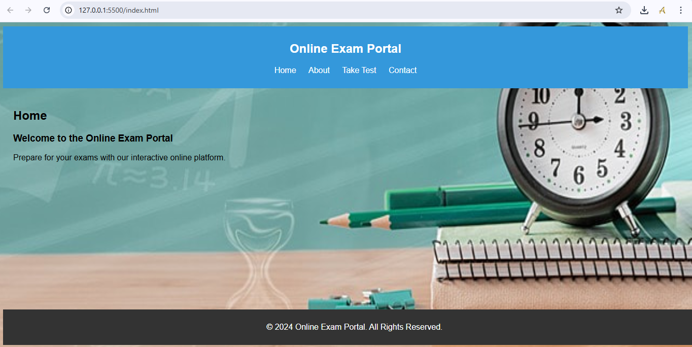
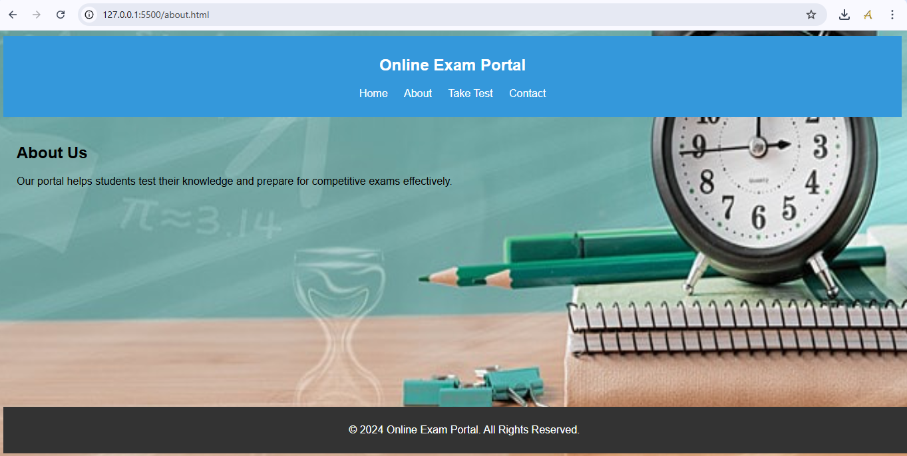
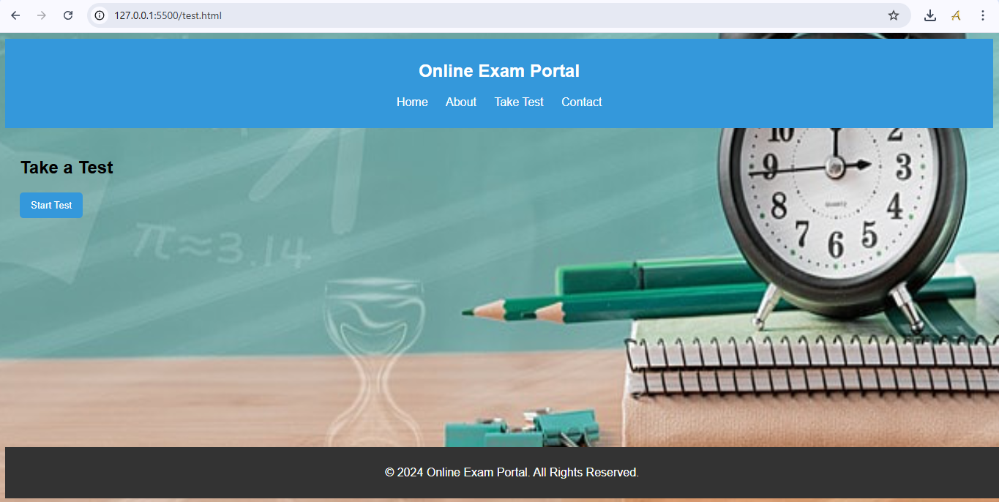
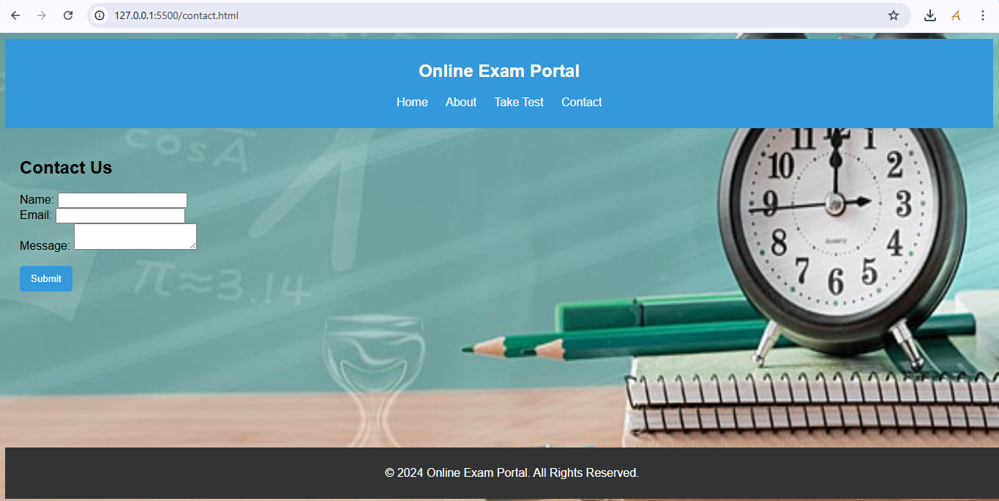
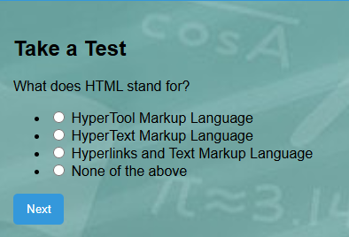
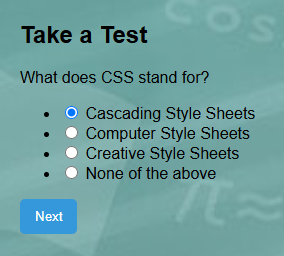
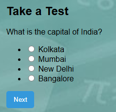
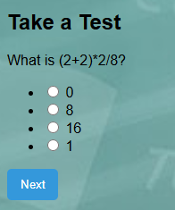
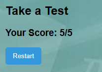

## 📝 Online Exam Portal
An online platform that allows administrators to create exams and students to take them in a secure, user-friendly environment. This project streamlines the examination process with features such as authentication, timed assessments, automatic grading, and result tracking.

## 🚀 Features
👨‍🏫 Admin Login and Dashboard

🧑‍🎓 Student Login and Exam Access

⏱️ Timer-based Online Exams

🧮 Automatic Result Calculation

🗃️ Question Management System (Add, Edit, Delete)

🔐 Secure Authentication

📊 View Results and Exam Reports

## 📂 Project Structure
```
Online-Exam-Portal/
│
├── admin/              # Admin-side logic and interface
├── user/               # Student-side logic and interface
├── database/           # MySQL database files and configurations
├── assets/             # CSS, JavaScript, and images
├── includes/           # PHP includes for modular components
├── index.php           # Home/landing page
└── README.md           # Project documentation
```
## 💻 Technologies Used

Frontend: HTML, CSS, JavaScript, Bootstrap

Backend: PHP

Database: MySQL

Tools: XAMPP / WAMP (for local development)

## 🛠️ Setup Instructions
Clone the repository
```
git clone https://github.com/Asish7980/Online-Exam-Portal.git
```
Import the Database

Open phpMyAdmin

Create a new database (e.g., online_exam)

Import the .sql file located in the database/ folder

Configure Database Connection

Open includes/connection.php

Update the database name, username, and password as per your local environment

Run the Project

Place the project in the htdocs folder of XAMPP

Start Apache and MySQL via XAMPP Control Panel

Visit http://localhost/Online-Exam-Portal in your browser

## 📸 Screenshots

### 🏠 Home Page  


### 🧑‍🎓 About 


### 🧑‍🎓 Take Test


### 🧑‍🎓 Contact 


### 🧑‍🎓 Questions


### 🧑‍🎓 Finish



## 🔑 Default Credentials (For Demo)
*Admin Login*
Username: admin
Password: admin123

*Student Login*
Register through the user panel or check the database for sample credentials.

## 🤝 Contributing
Contributions, issues, and feature requests are welcome!
Feel free to check the issues page.

## 📃 License
This project is licensed under the MIT License.
See the LICENSE file for details.

## by Asish
